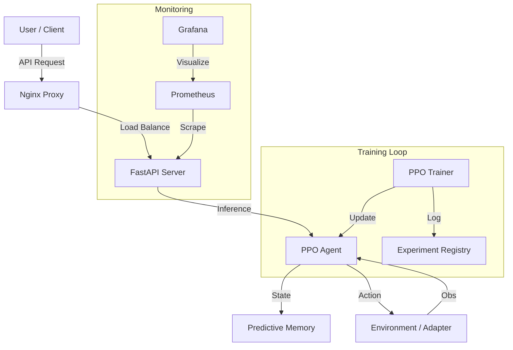

# CyborgMind v3.0

> **Unified, Production-Grade RL + Memory + API System**


CyborgMind is a high-performance Reinforcement Learning system featuring a unified PPO engine, Predictive Memory Module (PMM), and a hardened production API.

## 🚀 Key Features

- **Unified RL Core**: `cyborg_rl` engine with PPO, Mamba/GRU encoders, and PMM memory.
- **Production Training**: Mixed-Precision (AMP), Gradient Clipping, and Vectorized Environments.
- **Hardened API**: FastAPI server with JWT Auth, Rate Limiting, and Async Batch Inference.
- **Domain Adapters**: Ready-to-use adapters for Trading, Lab Instruments, and EEG.
- **Observability**: Full Prometheus/Grafana stack for training and inference metrics.
- **DevOps Ready**: Dockerized (CPU/GPU), K8s manifests, and CI/CD pipelines.

## 🛠️ Quick Start

### 1. Setup Environment
```bash
# Standard Gym
./setup_gym.sh

# Or Mamba + GPU
./setup_mamba_gpu.sh
```

### 2. Verify Installation
```bash
python quick_verify.py
```

### 3. Train an Agent
```bash
# Train on CartPole
python train_production.py --config configs/envs/gym_cartpole.yaml --run-name my-first-run
```

### 4. Run API Server
```bash
# Start server
uvicorn cyborg_rl.server:create_app --reload
```

## 📚 Documentation

- [Architecture Overview](docs/ARCHITECTURE.md)
- [Training Guide](docs/HOW_TO_TRAIN.md)
- [API Reference](docs/API.md)
- [Deployment Guide](docs/DEPLOYMENT.md)
- [Security Policy](docs/SECURITY.md)
- [Experiments & Registry](docs/EXPERIMENTS.md)
- [Monitoring](docs/MONITORING.md)

## 🏗️ Architecture


