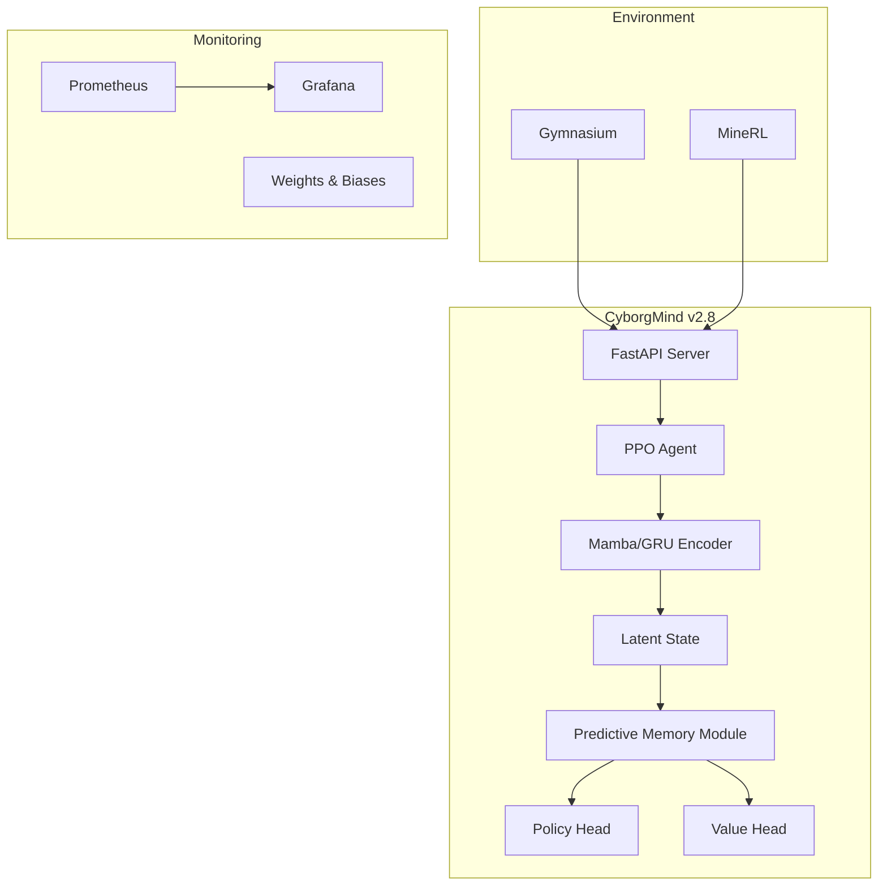

# CyborgMind v2.8

**Production-grade Reinforcement Learning System with Predictive Memory Module (PMM)**

CyborgMind is a high-performance RL brain designed for complex NPCs and agents. It features a hybrid Mamba/GRU architecture, differentiable external memory, and a production-ready API server.

## 🏗 Architecture



## 🚀 Quick Start

### 1. Docker (Recommended)

```bash
# Start training with GPU support
docker-compose --profile gpu up trainer-gpu

# Start API server and monitoring
docker-compose --profile monitoring up -d
```

### 2. Google Colab

Train directly in the cloud using our notebook:
`notebooks/CyborgMind_Colab.ipynb`

### 3. Local Dev

```bash
pip install -e .
python scripts/train_gym_cartpole.py
```

## 🧠 Key Features

- **PMM Memory**: Differentiable read/write memory with pressure-based intrinsic rewards.
- **Hybrid Encoder**: Mamba SSM for long-context efficiency + GRU for stability.
- **Production API**: FastAPI with token auth, batching, and Prometheus metrics.
- **Multi-Environment**: Unified adapters for Gym and MineRL (Minecraft).

## 📊 Monitoring

- **Grafana**: http://localhost:3000 (admin/cyborgmind)
- **API Health**: http://localhost:8000/health
- **Metrics**: http://localhost:8000/metrics

## 📂 Structure

- `cyborg_rl/`: Core library
  - `agents/`: PPO implementation
  - `memory/`: PMM logic
  - `server.py`: API server
- `scripts/`: Training and demo scripts
- `notebooks/`: Colab notebooks
- `docs/`: Documentation

## License

MIT License
