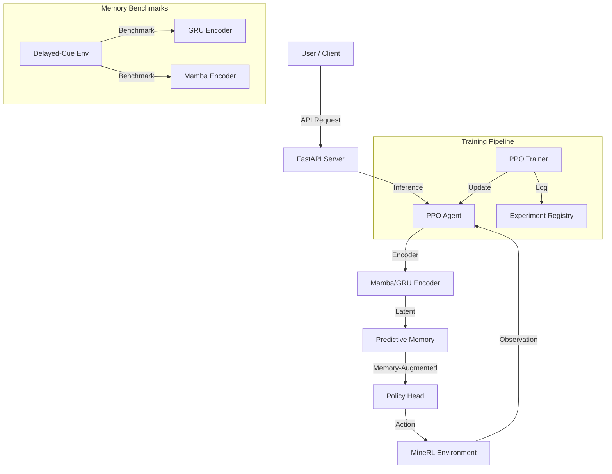

# CyborgMind v4.0 - MineRL Agent System

> **Production-Grade MineRL RL Agent with Long-Horizon Memory**


CyborgMind is a production-grade reinforcement learning system specialized for MineRL environments, featuring memory benchmarking (GRU vs Mamba vs Pseudo-Mamba), Predictive Memory Module (PMM), and a hardened PPO training pipeline with FastAPI deployment.

## 🚀 Key Features

- **MineRL-First Design**: Optimized for MineRL Treechop and navigation tasks
- **Memory Benchmarking Suite**: Compare GRU, Mamba, and Pseudo-Mamba (Pure PyTorch) on long-horizon tasks
- **Flexible Encoder Selection**: Switch between `gru`, `mamba`, `mamba_gru`, or `pseudo_mamba` via config
- **Production Training Pipeline**: 4-stage workflow with deterministic evaluation and artifact management
- **Predictive Memory Module (PMM)**: Differentiable memory with multi-head read/write
- **FastAPI Deployment**: Production-ready API server with JWT auth and rate limiting
- **Comprehensive Tracking**: ExperimentRegistry with git commits, system info, and metrics

---

## 📦 Installation

### Standard Installation (Gym environments)
```bash
./setup_gym.sh
```

### MineRL Installation
```bash
./setup_minerl.sh
```

### Mamba + GPU (Optional, for Mamba encoder)
```bash
./setup_mamba_gpu.sh
```

### Verify Installation
```bash
python quick_verify.py
```

---

## 🎯 Quick Start

### 1. Memory Benchmarks

Compare different encoder backbones on the Delayed-Cue memory task:

```bash
# Run with GRU encoder
python -m cyborg_rl.memory_benchmarks.pseudo_mamba_memory_suite \
    --task delayed_cue \
    --backbone gru \
    --horizon 1000 \
    --num-envs 64 \
    --steps 100000 \
    --device cuda \
    --seed 42 \
    --run-name delayed_cue_gru_h1000

# Run with Mamba encoder
python -m cyborg_rl.memory_benchmarks.pseudo_mamba_memory_suite \
    --task delayed_cue \
    --backbone mamba \
    --horizon 1000 \
    --num-envs 64 \
    --steps 100000 \
    --device cuda \
    --seed 42 \
    --run-name delayed_cue_mamba_h1000
```

Results saved to `experiments/memory_benchmarks/<run_name>/` with full metrics, checkpoints, and manifests.

### 2. Train MineRL Treechop Agent

```bash
# Full training pipeline with evaluation
python scripts/run_treechop_pipeline.py \
    --config configs/treechop_ppo.yaml \
    --run-name minerl_treechop_v1 \
    --steps 200000 \
    --device cuda

# Quick test run (fewer steps)
python scripts/run_treechop_pipeline.py \
    --config configs/treechop_ppo.yaml \
    --run-name test_run \
    --steps 10000 \
    --device cpu \
    --skip-eval
```

**Pipeline Stages**:
1. Environment & agent initialization
2. (Optional) Behavior cloning warm-start
3. PPO training with checkpointing
4. Deterministic evaluation (10 episodes with fixed seeds)

Results saved to `artifacts/minerl_treechop/<run_name>/` including:
- `best_model.pt` - Best model checkpoint
- `config.yaml` - Full configuration
- `eval_results.json` - Evaluation metrics
- `manifest.json` - Run metadata (git commit, system info)

### 3. Deploy API Server

```bash
# Launch API server with trained agent
python scripts/run_api_server.py \
    --config configs/treechop_ppo.yaml \
    --checkpoint artifacts/minerl_treechop/minerl_treechop_v1/best_model.pt \
    --host 0.0.0.0 \
    --port 8000 \
    --device cuda

# For development (with auto-reload)
python scripts/run_api_server.py \
    --config configs/treechop_ppo.yaml \
    --checkpoint artifacts/minerl_treechop/minerl_treechop_v1/best_model.pt \
    --reload
```

**API Endpoints**:
- `POST /step` - Get action for given observation
- `POST /reset` - Reset agent state
- `GET /health` - Health check
- `GET /metrics` - Prometheus metrics
- `POST /token/generate` - Generate JWT token (if enabled)

---

## 🏗️ Architecture



### Encoder Types

Configure via `model.encoder_type` in YAML:

- **`"gru"`** - Pure GRU encoder (baseline)
- **`"mamba"`** - Mamba SSM with GRU fallback if unavailable
- **`"mamba_gru"`** - Hybrid Mamba + GRU (default)
- **`"pseudo_mamba"`** - Pure PyTorch Linear RNN (Mamba-like) for benchmarking without CUDA kernels

---

## 📚 Documentation

- [Implementation Plan](file:///Users/dawsonblock/.gemini/antigravity/brain/4f92aba5-bde4-48b6-966e-ffbc619597ae/implementation_plan.md) - Detailed design and component breakdown
- [Task Checklist](file:///Users/dawsonblock/.gemini/antigravity/brain/4f92aba5-bde4-48b6-966e-ffbc619597ae/task.md) - Development progress tracker
- [Architecture Details](docs/ARCHITECTURE.md) - System architecture and design patterns
- [Training Guide](docs/HOW_TO_TRAIN.md) - Comprehensive training workflows
- [API Reference](docs/API.md) - API server endpoints and schemas
- [Deployment Guide](docs/DEPLOYMENT.md) - Production deployment strategies

---

## 🧪 Experimental Features

> [!WARNING]
> **Trading, EEG, and Lab adapters** are experimental modules not part of the hardened MineRL stack. Use at your own risk.

These modules exist in `cyborg_rl/envs/` but are not actively maintained or tested:
- `trading_adapter.py` - Stock trading environment (experimental)
- `eeg_adapter.py` - EEG signal processing (experimental)
- `lab_adapter.py` - Laboratory instrument control (experimental)

For production use, stick to the MineRL adapter and memory benchmarks.

---

## 🔬 Memory Benchmark Tasks

### Delayed-Cue (Full Implementation)
Tests ability to recall a cue after variable-length delay:
- **Cue Phase**: Present one-hot cue (1 step)
- **Delay Phase**: Neutral observations (horizon steps)
- **Query Phase**: Agent must produce correct action (1 step)

### Copy-Memory (Stub)
Tests sequence memorization:
- Observe sequence of symbols
- Delay period
- Reproduce sequence

### Associative Recall (Stub)
Tests key-value pair learning:
- Training phase: observe pairs
- Query phase: given key, produce value

---

## 🛠️ Configuration

Example `treechop_ppo.yaml`:

```yaml
# Model architecture
model:
  encoder_type: "mamba_gru"  # gru | mamba | mamba_gru | pseudo_mamba
  hidden_dim: 512
  latent_dim: 256
  use_mamba: true

# PPO hyperparameters
ppo:
  learning_rate: 3.0e-4
  gamma: 0.99
  clip_epsilon: 0.2

# Evaluation
eval:
  num_eval_episodes: 10
  eval_seeds: [1000, 1001, 1002, ...]
```

See `configs/treechop_ppo.yaml` for complete configuration options.

---

## 📊 Results

After running the MineRL Treechop pipeline, check:

```bash
# View evaluation results
cat artifacts/minerl_treechop/<run_name>/eval_results.json

# View full run manifest
cat artifacts/minerl_treechop/<run_name>/manifest.json

# View training metrics
cat experiments/runs/<run_name>/logs/metrics.csv
```

---

## 🐳 Docker Deployment

```bash
# Build image
docker build -t cyborg-mind:latest .

# Run API server
docker run -p 8000:8000 \
    -v $(pwd)/artifacts:/models \
    cyborg-mind:latest
```

Or use `docker-compose.yml`:

```bash
docker-compose up
```

---

## 🤝 Contributing

This is a focused MineRL agent system. Contributions should:
- Maintain MineRL-first focus
- Include tests for new features
- Update documentation
- Follow existing code style

---

## 📝 License

MIT License - see [LICENSE](LICENSE) file for details.

---

## 🎯 Next Steps

1. **Run a Memory Benchmark**: Test GRU vs Mamba on delayed-cue task
2. **Train Your First Agent**: Use the Treechop pipeline
3. **Deploy the API**: Launch the FastAPI server with your trained agent
4. **Customize**: Modify configs for your specific use case

For detailed guides, see the [documentation](docs/).
