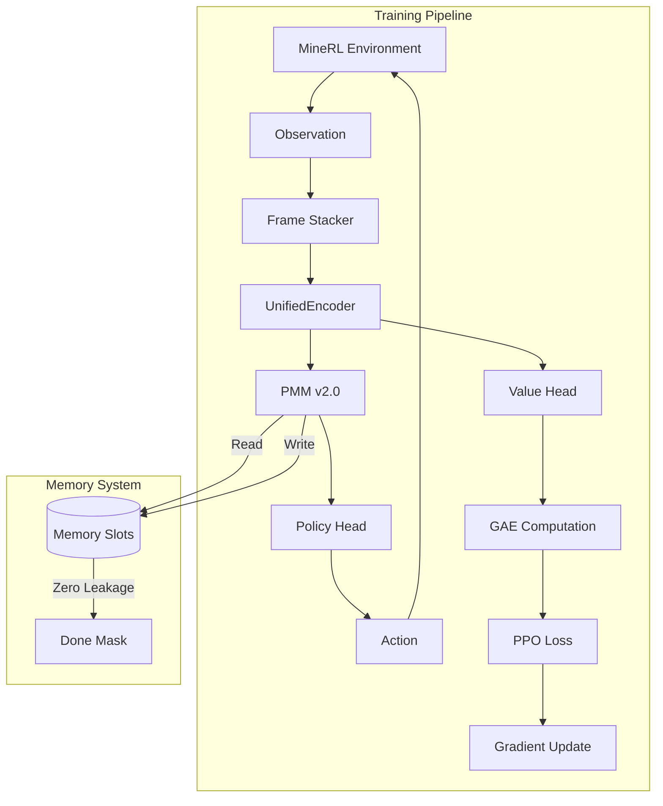

# CyborgMind v5.0 - MineRL Rebuild

> **Minimal, Ultra-Efficient MineRL-Only RL Engine with Honest Memory**


CyborgMind v5.0 is a complete architectural rebuild focused exclusively on MineRL environments. This version strips away legacy adapters and experimental modules to deliver a lean, production-grade reinforcement learning system.

---

## 🎯 Key Features

| Feature | Description |
|---------|-------------|
| **PMM v2.0** | Honest Memory Engine with controlled write gates, zero leakage, and cosine-similarity addressing |
| **UnifiedEncoder** | Runtime switching between GRU, Mamba, and Mamba-GRU backbones |
| **PPO v3.0** | Production trainer with vectorized environments, truncated BPTT, and AMP support |
| **RecurrentRolloutBuffer** | Sequence-preserving storage maintaining RNN state integrity across episodes |
| **Frame Stacking** | Efficient 4-frame latent stacking with auto-cropping and resizing |

---

## 🚀 Quick Start

### Installation

```bash
# Core dependencies
pip install -r requirements.txt

# For MineRL training (requires JDK 8)
pip install minerl

# For Mamba encoder (GPU only, requires CUDA)
pip install mamba-ssm causal-conv1d
```

### Verify Installation

```bash
# Run smoke test (no MineRL required)
python3 mine_rl_train.py --smoke-test
```

### Train Your First Agent

```bash
# Basic training command
python3 mine_rl_train.py \
    --env MineRLTreechop-v0 \
    --encoder gru \
    --memory pmm \
    --num-envs 4

# With WandB logging
python3 mine_rl_train.py \
    --env MineRLTreechop-v0 \
    --encoder gru \
    --memory pmm \
    --num-envs 4 \
    --wandb

# Using launcher script
./scripts/train_treechop.sh
```

---

## 📖 CLI Reference

| Argument | Type | Default | Description |
|----------|------|---------|-------------|
| `--env` | str | `MineRLTreechop-v0` | Environment ID |
| `--encoder` | str | `gru` | Encoder type: `gru`, `mamba`, `mamba_gru` |
| `--memory` | str | `pmm` | Memory type: `pmm` or `none` |
| `--num-envs` | int | 4 | Number of parallel environments |
| `--steps` | int | 1000000 | Total training timesteps |
| `--horizon` | int | 2048 | Rollout horizon per update |
| `--burn-in` | int | 0 | Burn-in steps for truncated BPTT |
| `--lr` | float | 0.0003 | Learning rate |
| `--wandb` | flag | - | Enable Weights & Biases logging |
| `--smoke-test` | flag | - | Run quick verification with mock environment |
| `--config` | str | `configs/unified_config.yaml` | Path to config file |

---

## 🏗️ Architecture

### Directory Structure

```
cyborg_mind/
├── configs/
│   └── unified_config.yaml       # Primary configuration
├── cyborg_rl/                    # Core package
│   ├── agents/                   # Agent wrappers
│   ├── envs/                     # Environment adapters
│   │   ├── base.py               # Abstract base adapter
│   │   └── minerl_adapter.py     # MineRL implementation
│   ├── memory/                   # Memory systems
│   │   ├── pmm.py                # Predictive Memory Module v2.0
│   │   └── recurrent_rollout_buffer.py
│   ├── models/                   # Neural network components
│   │   ├── encoder.py            # UnifiedEncoder (GRU/Mamba)
│   │   ├── policy.py             # Policy head
│   │   └── value.py              # Value head
│   ├── trainers/                 # Training logic
│   │   └── ppo_trainer.py        # PPO v3.0
│   └── utils/                    # Utilities
│       ├── config.py             # Dataclass configs
│       ├── device.py             # Device management
│       └── logging.py            # Structured logging
├── scripts/                      # Launcher scripts
│   ├── train_treechop.sh         # Full training launcher
│   └── verify_treechop.sh        # Verification script
├── legacy/                       # Deprecated modules
└── mine_rl_train.py              # Unified entry point
```

### Component Overview



---

## 🧠 PMM v2.0: Honest Memory Engine

The Predictive Memory Module (PMM) v2.0 implements "Honest Memory" principles:

### Key Features

| Feature | Description |
|---------|-------------|
| **Controlled Write Gate** | Learnable gate targeting specific sparsity rates (default: 1/2000 steps) |
| **Zero Leakage** | Strict memory masking on episode termination—no information bleeds across episodes |
| **Cosine Addressing** | Deterministic read/write via cosine similarity with softmax sharpening |
| **Diagnostics** | Tracks write strength, read entropy, and sparsity loss for debugging |

### Memory Interface

```python
# Single-step forward
read_vector, next_memory, logs = pmm(
    current_memory,    # (B, Slots, Dim)
    hidden_state,      # (B, Dim) from encoder
    mask               # (B, 1) - 0 to reset on done
)

# Sequence processing (for training)
read_sequence, aux_logs = pmm.forward_sequence(
    init_memory,       # (B, Slots, Dim)
    hidden_sequence,   # (B, L, Dim)
    masks              # (B, L, 1)
)
```

### Configuration

```yaml
pmm:
  enabled: true
  num_slots: 16           # Number of memory slots
  memory_dim: 512         # Dimension per slot
  write_rate_target: 2000 # 1/N write frequency
  gate_type: soft         # "soft" or "hard"
  sharpness: 2.0          # Softmax temperature
```

---

## 🔧 UnifiedEncoder

The UnifiedEncoder provides runtime switching between sequence modeling backends:

### Supported Backends

| Backend | Description | Use Case |
|---------|-------------|----------|
| `gru` | Pure GRU layers | Baseline, CPU-friendly |
| `mamba` | Mamba SSM (or PseudoMamba fallback) | Long sequences, GPU |
| `mamba_gru` | Hybrid Mamba → GRU | Best of both worlds |

### Fallback Behavior

When `mamba-ssm` is not installed (CPU/Mac), the system automatically falls back to **PseudoMamba**—a pure PyTorch implementation of linear recurrent units that provides similar functionality without CUDA kernels.

### Configuration

```yaml
model:
  encoder: gru            # gru | mamba | mamba_gru
  hidden_dim: 512         # RNN hidden size
  latent_dim: 256         # Output embedding size
  num_layers: 2           # Number of recurrent layers
  dropout: 0.0            # Dropout rate
```

---

## 📊 PPO v3.0 Trainer

The PPO trainer is production-hardened with:

### Features

| Feature | Description |
|---------|-------------|
| **Vectorized Environments** | Parallel rollout collection across N environments |
| **Truncated BPTT** | Configurable burn-in for long sequences |
| **Per-Env Buffers** | Separate `RecurrentRolloutBuffer` per environment for sequence integrity |
| **AMP Support** | Automatic Mixed Precision for faster GPU training |
| **torch.compile** | Optional graph compilation for speedups |
| **Checkpoint System** | Periodic model saving with full state recovery |

### Training Loop

```
1. Reset environments → Get initial observations
2. For each step in horizon:
   a. Encode observation → Get hidden state
   b. PMM read/write → Get memory-augmented features
   c. Policy forward → Sample action
   d. Value forward → Estimate value
   e. Step environment → Get next obs, reward, done
   f. Store to per-env buffer
3. Compute GAE advantages
4. For each PPO epoch:
   a. Sample sequences from buffer
   b. Compute policy/value loss with BPTT
   c. Update networks
5. Repeat from step 2
```

### Configuration

```yaml
train:
  num_envs: 4             # Parallel environments
  horizon: 2048           # Steps per rollout
  batch_size: 256         # Minibatch size
  total_timesteps: 1000000
  learning_rate: 0.0003
  gamma: 0.99             # Discount factor
  gae_lambda: 0.95        # GAE lambda
  burn_in: 0              # Burn-in steps for BPTT
  amp: false              # Mixed precision
  compile: false          # torch.compile
  
ppo:
  clip_epsilon: 0.2       # PPO clip range
  entropy_coef: 0.01      # Entropy bonus
  value_coef: 0.5         # Value loss coefficient
  max_grad_norm: 0.5      # Gradient clipping
  ppo_epochs: 4           # Update epochs per rollout
```

---

## 🎮 MineRL Adapter

The MineRL adapter provides optimized environment interaction:

### Features

| Feature | Description |
|---------|-------------|
| **Frame Stacking** | 4-frame latent stacking for temporal context |
| **Auto-Resize** | Efficient 64x64 image resizing |
| **Center Cropping** | Optional cropping for focused observation |
| **Compass Integration** | Combines POV with compass data |
| **Vectorization** | Serial or parallel environment management |

### Configuration

```yaml
env:
  name: MineRLTreechop-v0
  image_size: [64, 64]
  frame_stack: 4
  crop_center: false
  max_steps: 18000        # Episode timeout
```

---

## 📈 Performance Expectations

| Metric | Expected Value |
|--------|----------------|
| **Treechop Solve** | ~500K-1M steps with PMM |
| **Throughput** | ~1000 env steps/sec (4 envs, CPU) |
| **Memory** | ~2GB VRAM (GPU) / ~4GB RAM (CPU) |
| **Convergence** | 20-30% faster than GRU-only baseline |

---

## 🐳 Docker Deployment

```bash
# Build image
docker build -t cyborg-mind:v5 .

# Run training
docker run --gpus all \
    -v $(pwd)/checkpoints:/app/checkpoints \
    cyborg-mind:v5 \
    python3 mine_rl_train.py --env MineRLTreechop-v0

# Use docker-compose
docker-compose up
```

---

## 📚 Documentation

| Document | Description |
|----------|-------------|
| [Architecture](docs/ARCHITECTURE.md) | System design and patterns |
| [Training Guide](docs/HOW_TO_TRAIN.md) | Step-by-step training workflows |
| [API Reference](docs/API.md) | FastAPI server endpoints |
| [Deployment](docs/DEPLOYMENT.md) | Production deployment strategies |
| [Troubleshooting](docs/TROUBLESHOOTING.md) | Common issues and solutions |

---

## 🗂️ Legacy Components

The following have been moved to `legacy/` and are not part of the core stack:

- Trading, EEG, Lab environment adapters
- Old experiment scripts and configs
- Monitoring dashboards (Grafana, Prometheus)
- V2/V3 architecture code

To use legacy components:
```bash
pip install -r requirements-experimental.txt
```

---

## 🤝 Contributing

Contributions should:
1. Maintain MineRL-first focus
2. Include tests for new features
3. Update documentation
4. Follow the existing code style (Black, Ruff)

```bash
# Run linters
black cyborg_rl/
ruff check cyborg_rl/

# Run tests
pytest tests/
```

---

## 📝 License

MIT License - see [LICENSE](LICENSE) for details.

---

## 🎯 Next Steps

1. **Verify Installation**: `python3 mine_rl_train.py --smoke-test`
2. **Train Agent**: `./scripts/train_treechop.sh`
3. **Monitor Progress**: Enable `--wandb` for real-time metrics
4. **Tune Hyperparameters**: Edit `configs/unified_config.yaml`
5. **Scale Up**: Increase `--num-envs` and enable `--compile` on GPU
