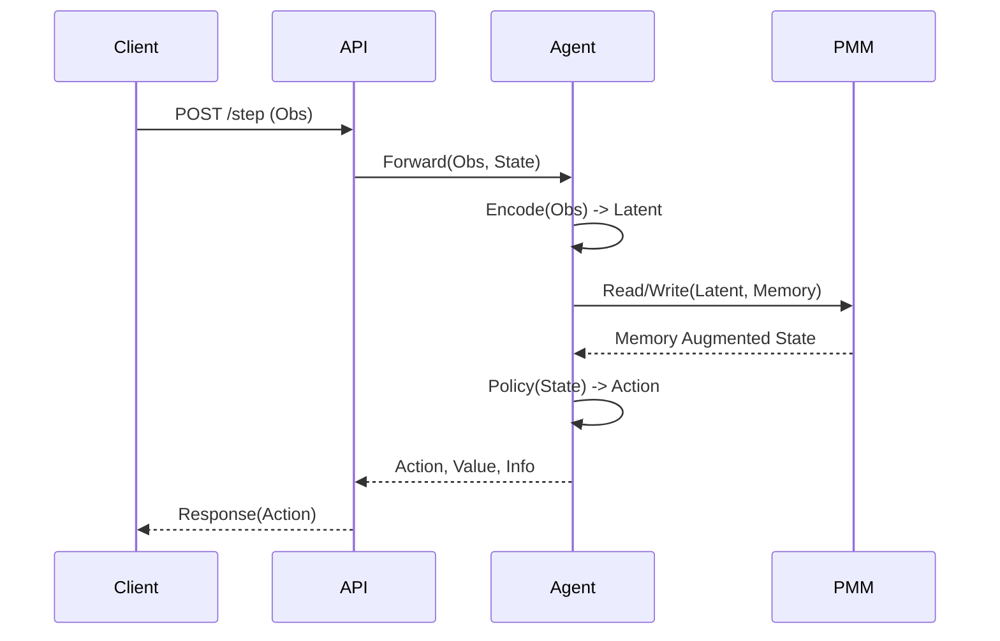
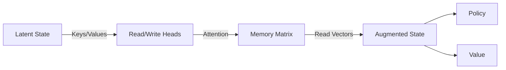

# System Architecture

## Overview

CyborgMind v3.0 is built on a modular, component-based architecture designed for scalability and production deployment.

## Core Components

### 1. RL Engine (`cyborg_rl`)
The heart of the system.
- **Agent**: `PPOAgent` with Mamba/GRU encoders.
- **Memory**: `PredictiveMemoryModule` (PMM) for long-term state retention.
- **Trainer**: `PPOTrainer` supporting AMP and vectorized environments.

### 2. Domain Adapters (`cyborg_rl/envs`)
Abstraction layer for connecting to various environments.
- **GymAdapter**: Standard OpenAI Gym/Gymnasium interface.
- **TradingAdapter**: Financial markets (Crypto/Stocks).
- **LabAdapter**: Physical lab instruments.
- **EEGAdapter**: Brain-Computer Interfaces.

### 3. API Server (`cyborg_rl/server.py`)
High-performance inference server.
- **FastAPI**: Async framework.
- **Auth**: JWT/HMAC.
- **Batching**: Dynamic batching for throughput.

## Data Flow

## Memory Architecture (PMM)

The Predictive Memory Module uses a differentiable read/write mechanism with content-based addressing.

